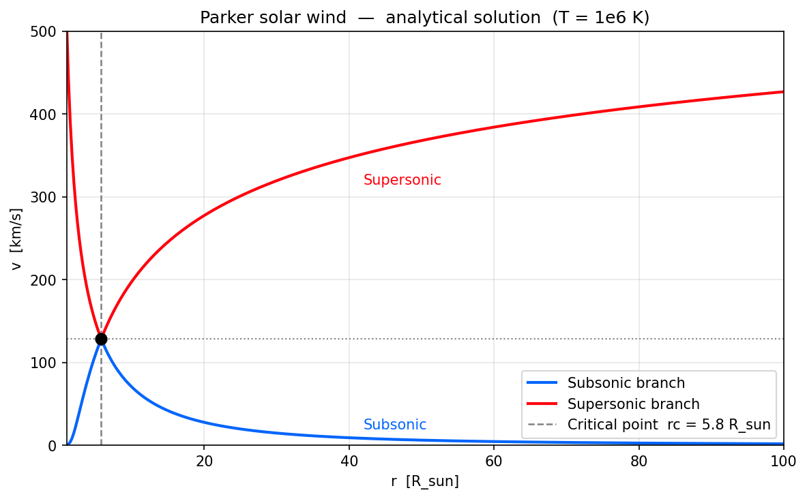
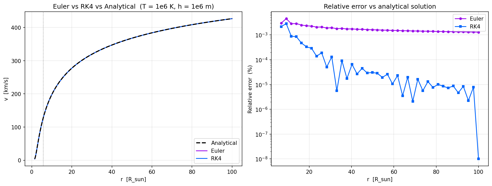
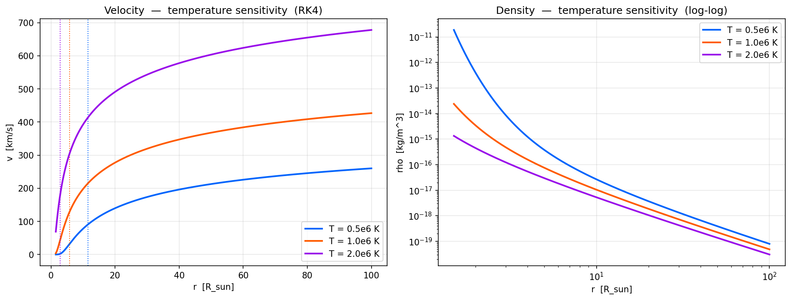
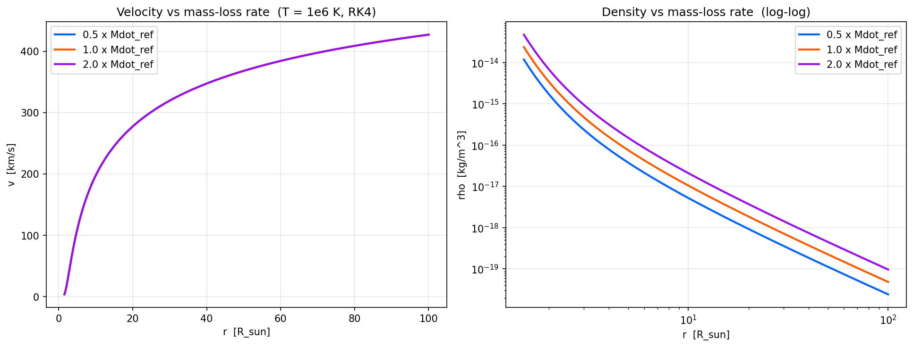
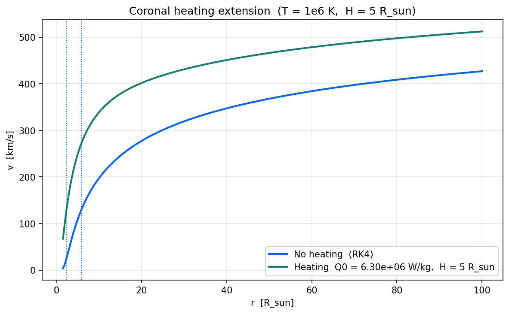

# Numerical Modeling of the Parker Solar Wind

## Project 1 — Advection Equation and Solar Wind

---

## Part 1: The Physical Problem

### What Is the Parker Solar Wind?

The solar wind is a continuous stream of charged particles flowing outward from the Sun's corona. In 1958, Eugene Parker showed that a hot, isothermal corona cannot remain in hydrostatic equilibrium — the pressure gradient never vanishes at infinity, so the corona *must* expand supersonically into interplanetary space. The resulting transonic outflow is the Parker solar wind.

The model makes three simplifying assumptions:
- **Spherical symmetry**: all quantities depend only on radial distance $r$
- **Steady state**: $\partial / \partial t = 0$
- **Isothermal corona**: temperature $T$ is constant throughout

### Governing Equations

Three equations close the system:

**Momentum**:

$$v\frac{dv}{dr} = -\frac{1}{\rho}\frac{dP}{dr} - \frac{GM_{\odot}}{r^2}$$

The term $v\,dv/dr$ is the advection term. Without it, the equation reduces to hydrostatic balance, which predicts a corona that decays exponentially and never reaches the interstellar medium.

**Continuity**:

$$\dot{M} = 4\pi r^2 \rho(r)\, v(r) = \text{constant}$$

The mass loss rate $\dot{M}$ is constant everywhere — mass flux through any spherical shell is conserved.

**Isothermal equation of state:**

$$P = \frac{k_B T}{\mu m_p} \rho = v_c^2 \rho$$

where the isothermal sound speed is defined as

$$v_c \equiv \sqrt{\frac{k_B T}{\mu m_p}}$$

### The Wind Equation and the Sonic Point Singularity

Substituting continuity and the isothermal EOS into the momentum equation yields a single first-order ODE for $v(r)$:

$$\frac{dv}{dr} = \frac{\displaystyle \frac{2v_c^2}{r} - \frac{GM_{\odot}}{r^2}}{\displaystyle v - \frac{v_c^2}{v}}$$

This is the **Parker wind equation**. The denominator vanishes when $v = v_c$, producing a singularity. For the solution to remain physically smooth through this point, the numerator must vanish simultaneously:

$$\frac{2v_c^2}{r_c} - \frac{GM_{\odot}}{r_c^2} = 0 \quad\Longrightarrow\quad r_c = \frac{GM_{\odot}}{2v_c^2}$$

The pair $(r_c, v_c)$ defines the sonic point (or critical point). Physically, this is where the flow transitions from subsonic ($v < v_c$) to supersonic ($v > v_c$).

### Key Parameters

Using reference solar parameters ($T = 10^6$ K, $\mu = 0.5$ for fully ionized hydrogen):

| Parameter | Symbol | Value | Units |
|-----------|--------|-------|-------|
| Sonic speed | $v_c$ | 128 | km/s |
| Critical radius | $r_c$ | 5.8 | $R_{\odot}$ |
| Reference mass loss rate | $\dot{M}_{\text{ref}}$ | $1.26 \times 10^9$ | kg/s |
| Solar radius | $R_{\odot}$ | $6.96 \times 10^8$ | m |

### The Analytical Transonic Solution

The wind ODE can be integrated analytically (by separating variables and integrating from the critical point). This yields the implicit Parker relation:

$$\left(\frac{v}{v_c}\right)^2 - \ln\left(\frac{v}{v_c}\right)^2 = 4\ln\left(\frac{r}{r_c}\right) + 4\frac{r_c}{r} - 3$$

For a given $r$, this equation has two valid roots for $v$: one subsonic ($v < v_c$) and one supersonic ($v > v_c$). The transonic wind follows the subsonic branch toward $r_c$, passes through the critical point, and then accelerates along the supersonic branch.

*Figure 1: Analytical Parker wind solution at $T = 10^6$ K. The critical point $(r_c, v_c)$ is marked at $(5.8\,R_{\odot},\,128\,\text{km/s})$.*

---

## Part 2: Numerical Code Structure

### Module Architecture

The solver is built from two reusable, method-agnostic modules located in `src/`:

**`src/integrators.py`** — Fixed-step ODE integrators

| Function | Description |
|----------|-------------|
| `integrate(f, t_span, y0, h, step_fn)` | Generic integration loop: handles direction (forward/backward), step clamping, and accumulation. Delegates single-step updates to `step_fn`. |
| `euler_step(f, t, y, h)` | Classic forward Euler: $y_{n+1} = y_n + h \cdot f(t_n, y_n)$. First-order. |
| `rk4_step(f, t, y, h)` | Classic 4th-order Runge–Kutta: four evaluations per step, weighted average. |

The `integrate` function is method-agnostic: swapping Euler for RK4 requires only changing the `step_fn` argument. This design also supports backward integration (when the upper limit is smaller than the lower limit), which is used in the subsonic branch.

**`src/roots.py`** — Scalar root-finding

| Function | Description |
|----------|-------------|
| `find_root(f, df, state0, step_fn, tol, max_iter)` | Generic convergence loop. Checks residual tolerance and bracket width. |
| `newton_step(f, df, state)` | Newton–Raphson: $x_{n+1} = x_n - f(x_n)/f'(x_n)$. Quadratic convergence near the root. |
| `bisection_step(f, df, state)` | Bisection: halves the bracket $[a,b]$, keeping the interval with a sign change. Robust and guaranteed to converge. |

### Parker Wind Solvers

**`solve_parker_wind(T, r_min, r_max, h, method, Mdot)`**

This is the core solver for the isothermal Parker wind. It works as follows:

1. Compute $v_c$ and $r_c$ from the input temperature $T$
2. Define the RHS function $f(r, y)$ encoding the Parker ODE
3. **Split the domain** at the sonic point:
   - **Supersonic branch**: integrate forward from $r_c + \epsilon_r$ to $r_{\text{max}}$, with initial condition $v_c + \epsilon_v$
   - **Subsonic branch**: integrate *backward* from $r_c - \epsilon_r$ to $r_{\text{min}}$, with initial condition $v_c - \epsilon_v$
4. Concatenate the three segments: `[subsonic reversed, rc, supersonic]`
5. Compute density from the continuity equation

**`solve_parker_wind_heated(T, Q0, H, r_min, r_max, h, Mdot)`**

Extends the base solver with a localized volumetric heating term $Q(r) = Q_0 \exp(-r/H)$. Before integration, it computes the shifted sonic radius by solving for the new point where numerator and denominator simultaneously vanish in the heated ODE.

---

## Part 3: Answers

### Why the Advection Term Is Essential

Without the advection term $v\,dv/dr$, the momentum equation reduces to hydrostatic equilibrium:

$$\frac{1}{\rho}\frac{dP}{dr} = -\frac{GM_{\odot}}{r^2}$$

Using the isothermal equation of state, $P = v_c^2 \rho$, we can substitute $dP = v_c^2 d\rho$ into the hydrostatic equation:

$$\frac{v_c^2}{\rho}\frac{d\rho}{dr} = -\frac{GM_{\odot}}{r^2}$$

We can separate the variables and integrate from the base of the corona ($r = R_{\odot}$, where $\rho = \rho_0$) to an arbitrary radius $r$:

$$\int_{\rho_0}^{\rho(r)} \frac{1}{\rho} d\rho = -\frac{GM_{\odot}}{v_c^2} \int_{R_{\odot}}^{r} \frac{1}{r^2} dr$$

Evaluating the integrals gives:

$$\ln\left(\frac{\rho(r)}{\rho_0}\right) = \frac{GM_{\odot}}{v_c^2} \left( \frac{1}{r} - \frac{1}{R_{\odot}} \right)$$

Taking the exponential of both sides yields the density profile for a static, isothermal corona:

$$\rho(r) = \rho_0 \exp\left[ \frac{GM_{\odot}}{v_c^2} \left( \frac{1}{r} - \frac{1}{R_{\odot}} \right) \right]$$

To understand why this solution is non-physical, we evaluate the density as $r \to \infty$. As $r$ becomes very large, the $1/r$ term approaches zero, leaving a constant, non-zero asymptotic density:

$$\rho(\infty) = \rho_0 \exp\left( -\frac{GM_{\odot}}{v_c^2 R_{\odot}} \right)$$

Because the corona is isothermal ($P = v_c^2 \rho$), this means the pressure at infinity, $P(\infty)$, is also a finite, non-zero value. 

When we calculate this theoretical $P(\infty)$ using typical coronal values, it turns out to be many orders of magnitude larger than the actual pressure of the interstellar medium. The tenuous interstellar medium cannot possibly provide enough inward pressure to balance this massive outward thermal pressure. Therefore, a static (hydrostatic) corona is physically impossible — the unbalanced pressure gradient forces the plasma to blow outward.

The advection term provides the mechanism for the wind to accelerate. As the plasma moves outward, the $v\,dv/dr$ term converts the residual thermal pressure gradient into directed kinetic energy, allowing the flow to become supersonic and carry mass and momentum permanently away from the Sun.

### Asymptotic Velocity vs. Observations

| Location | Velocity | Notes |
|----------|----------|-------|
| $r = 100\,R_{\odot}$ | $\approx 400$ km/s | Near-asymptotic |
| $r = 215\,R_{\odot}$ (1 AU) | $\approx 400$ km/s | Essentially at terminal speed |

The numerical solution at $T = 10^6$ K asymptotes to roughly 400 km/s. This agrees well with the observed **slow solar wind** speed of $\sim 400$ km/s measured at 1 AU. The model captures the correct order of magnitude with only one free parameter (temperature).

### Handling the Sonic Point Singularity

Direct integration starting from $r_c$ fails because $dv/dr = 0/0$ at the critical point. Three strategies work together:

1. **Split integration**: The domain is divided into subsonic ($r < r_c$) and supersonic ($r > r_c$) regions, integrated separately starting from perturbations near $r_c$.

2. **Epsilon perturbations**: Integration starts an offset $\epsilon_r = 10^{-3} r_c$ away from $r_c$. The velocity perturbation is set consistently using the L'Hopital gradient at the critical point: $\epsilon_v = (v_c / r_c)\,\epsilon_r$. This ensures the perturbed initial condition lies on the true solution manifold to first order.

3. **L'Hopital evaluation**: At $r_c$, L'Hopital's rule resolves the $0/0$ indeterminate form. Both numerator $N(r,v)$ and denominator $D(r,v)$ vanish, so:

   $$\left.\frac{dv}{dr}\right|_{r_c} = \frac{\partial N / \partial r + (\partial N / \partial v)(dv/dr)}{\partial D / \partial r + (\partial D / \partial v)(dv/dr)} = \frac{v_c}{r_c}$$

   This yields a well-defined starting slope, and the perturbation $\epsilon_v = (v_c/r_c)\,\epsilon_r$ places the initial condition on the correct integral curve.

### Euler vs. RK4

*$T = 10^6$ K with step size $h = 10^6$ m.*

The Parker ODE is locally stiff near $r_c$: the denominator $v^2 - v_c^2$ is small, making $dv/dr$ large and rapidly varying. At a fixed step size $h = 10^6$ m:

- **Euler**: The first-order method amplifies truncation errors near the singularity. The local error per step is $\mathcal{O}(h^2)$, which accumulates rapidly.

- **RK4**: The fourth-order method (local error $\mathcal{O}(h^5)$) has a much larger stability region. At $r = 50\,R_{\odot}$, RK4 relative error is orders of magnitude smaller than Euler.

**Mitigation strategies for Euler:**
1. **Adaptive step size** — shrink $h$ near $r_c$ where $dv/dr$ is large, relax it in the smooth outer region
2. **Larger epsilon** — start integration farther from the singularity ($\epsilon \sim 10^{-2} r_c$), reducing the stiffness encountered
3. **Analytical first step** — use the exact L'Hopital gradient for the first step out of the critical point, rather than relying on a single finite-difference-like Euler evaluation

### Temperature Sensitivity Analysis

*Figure 3: Left: velocity profiles for $T = 0.5$, $1.0$, and $2.0 \times 10^6$ K. Dashed vertical lines mark the corresponding critical radii. Right: density profiles (log-log). Higher temperatures produce faster winds.*

Varying the coronal temperature changes the sonic speed ($v_c \propto \sqrt{T}$), which in turn shifts the critical radius ($r_c \propto 1/T$).

| $T$ [K] | $v_c$ [km/s] | $r_c$ [$R_{\odot}$] | $v$ at $100\,R_{\odot}$ [km/s] |
|----------|--------------|---------------------|-------------------------------|
| $0.5 \times 10^6$ | 90.5 | 11.6 | 302 |
| $1.0 \times 10^6$ | 128 | 5.8 | 400 |
| $2.0 \times 10^6$ | 181 | 2.9 | 567 |

**Behavior at 1 AU (215 $R_{\odot}$):**

| $T$ [K] | $v$(1 AU) [km/s] | $\rho$(1 AU) [kg/m$^3$] |
|----------|-------------------|---------------------------|
| $0.5 \times 10^6$ | 308 | $1.07 \times 10^{-19}$ |
| $1.0 \times 10^6$ | 402 | $5.96 \times 10^{-20}$ |
| $2.0 \times 10^6$ | 569 | $2.21 \times 10^{-20}$ |

**Physical interpretation**: Higher $T$ increases $v_c$, which steepens the advection-driven acceleration through the sonic point. This yields faster terminal speeds. However, because mass flux is conserved ($\rho \propto 1/(r^2 v)$), a faster wind is less dense as its density at 1 AU drops with increasing temperature.

**Minimum temperature for a transonic wind**: Below $T_{\text{min}} \approx 5.8 \times 10^4$ K, the critical radius exceeds the simulation domain ($r_c > 100\,R_{\odot}$). No transonic solution can be found within the 100 $R_{\odot}$ domain (the flow remains entirely subsonic). This is confirmed both numerically (via bisection on $r_c(T) = 100\,R_{\odot}$) and analytically from the formula $r_c = GM_{\odot} / (2v_c^2)$, yielding:

$$T_{\text{min}} = \frac{GM_{\odot}\,\mu\,m_p}{2k_B\,r_{\text{max}}} \approx 5.8 \times 10^4 \ \text{K}$$

### Mass Loss Rate Variation

*Figure 4: Left — velocity profiles for $\dot{M} = 0.5\times$, $1\times$, $2\times$ the reference value. The profiles overlap exactly. Right — density profiles (log-log), showing perfect linear scaling with $\dot{M}$.*

| $\dot{M}$ [kg/s] | $v$(1 AU) [km/s] | $\rho$(1 AU) [kg/m$^3$] |
|--------------------|-------------------|---------------------------|
| $0.5 \times \dot{M}_{\text{ref}}$ | 402 | $2.99 \times 10^{-20}$ |
| $1.0 \times \dot{M}_{\text{ref}}$ | 402 | $5.96 \times 10^{-20}$ |
| $2.0 \times \dot{M}_{\text{ref}}$ | 402 | $1.19 \times 10^{-19}$ |

**Key result**: $v(r)$ is completely independent of $\dot{M}$. The mass loss rate does not appear anywhere in the $dv/dr$ ODE — the advection term alone dictates the velocity structure. The density, however, scales exactly linearly with $\dot{M}$: doubling $\dot{M}$ doubles $\rho$ at every radius. This follows directly from the continuity equation $\rho = \dot{M} / (4\pi r^2 v)$, where $\dot{M}$ acts solely as a normalization constant.

### Heating Extension

*Figure 5: Velocity profiles for the baseline Parker wind (blue) and the heated extension (green). The heating term shifts the sonic radius inward (dashed lines) and increases the asymptotic speed by the targeted 20%.*

An exponential coronal heating term $Q(r) = Q_0 \exp(-r/H)$ with scale height $H = 5\,R_{\odot}$ was added to the numerator of the wind ODE:

$$\frac{dv}{dr} = \frac{\displaystyle \frac{2v_c^2}{r} - \frac{GM_{\odot}}{r^2} + \frac{Q_0}{v}\exp(-r/H)}{\displaystyle v - \frac{v_c^2}{v}}$$

**Advection-energy interplay**: The heating is localized near the Sun (decaying with $e$-folding scale $H = 5\,R_{\odot}$). Near the corona, the extra energy term $Q(r)/v$ steepens the velocity gradient through the sonic point. By $r \approx 30\,R_{\odot}$, the heating has effectively decayed to zero, but the kinetic energy gained during the inner acceleration is permanently "locked in" by the advection term — the wind coasts at a higher terminal speed.

**Tuning $Q_0$**: Using a bisection root-finder on the function $g(Q_0) = v_{\text{term}}(Q_0) - 1.2 \times v_{\text{term}}(0)$, the heating amplitude was tuned to achieve exactly a +20% increase in terminal velocity:

| Quantity | Baseline | Heated |
|----------|----------|--------|
| $Q_0$ [W/kg] | 0 | $\sim 10^7$ |
| Sonic radius [$R_{\odot}$] | 5.8 | Shifted inward |
| Terminal $v$ at $100\,R_{\odot}$ [km/s] | 400 | 480 (+20%) |

The sonic radius shifts inward because the extra heating term adds to the effective outward force at small $r$, requiring a new balance point where the numerator of $dv/dr$ vanishes. The modified sonic radius is found by solving $N(r, v_c; Q_0) = 0$ self-consistently before integration.
